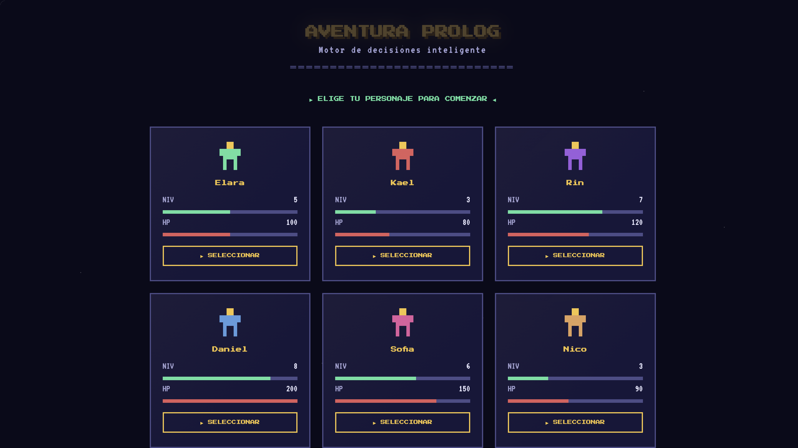
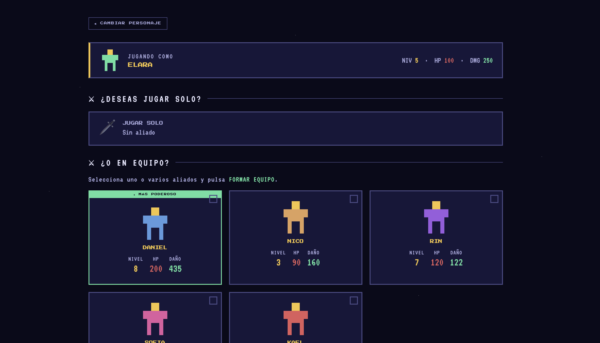
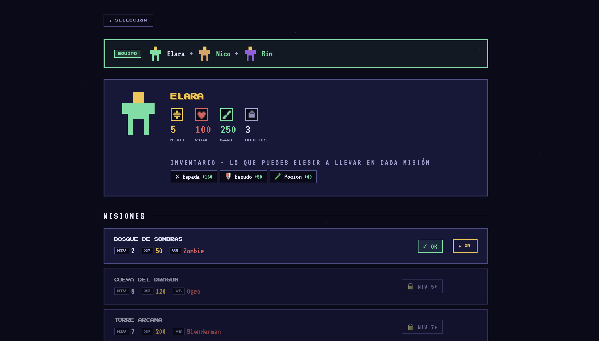
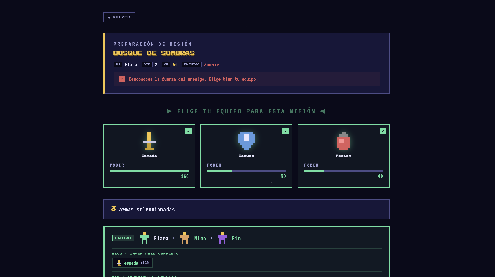
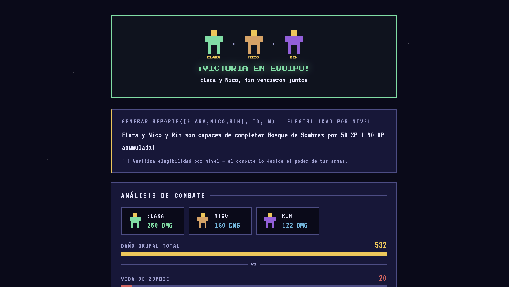
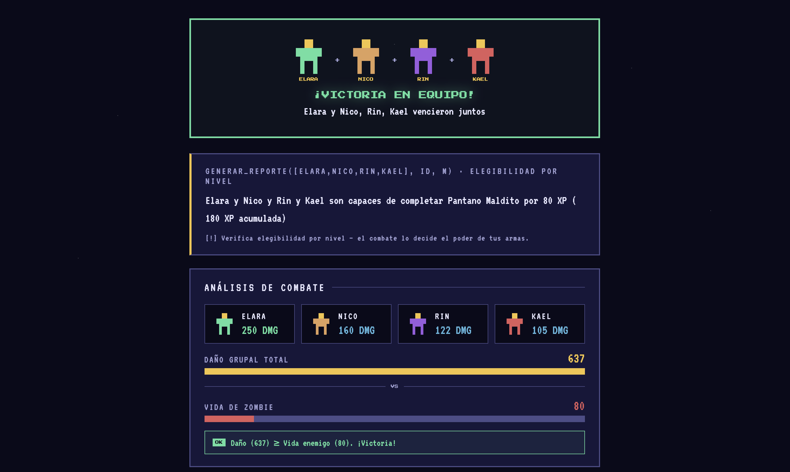

# Aventura Prolog

**Materia**: Lenguajes de Programación | **Periodo**: 2026-1 | **Estado**: Completado

Juego de aventura RPG cuyo motor de decisiones está escrito en **Prolog** (SWI-Prolog) y se presenta a través de una interfaz web en **Laravel 9**. El objetivo académico del proyecto es demostrar el paradigma lógico: toda la lógica del juego (qué misiones puedes aceptar, si una misión es peligrosa, quién es el mejor aliado y el reporte narrativo del combate) la resuelve Prolog mediante reglas, no PHP.

## Equipo de trabajo

- [Pau](https://github.com/paumquintana)


## Capturas / Demo

**Selección de personaje** — el jugador elige entre 6 personajes con stats (nivel y vida) cargados desde Prolog.



**Formación de equipo** — jugar solo o sumar uno o varios aliados. Prolog calcula el daño de cada aliado y marca al más poderoso.



**Ficha del personaje y misiones** — inventario del personaje y misiones filtradas por la regla `puede_aceptar/2`. Cada misión muestra su enemigo y un indicador de peligro (`nivel_peligro/3`).



**Preparación de misión** — selección de armas antes de combatir, con el poder de cada una.



**Resultado de batalla** — reporte narrativo generado por `generar_reporte/3` y análisis de combate con el daño grupal (`danogrupal/2`) frente a la vida del enemigo.



**Vista grupal** — resultado de una misión en equipo: contribución de daño de cada integrante y el daño grupal total (`danogrupal/2`) frente a la vida del enemigo.



### Demo en video

▶ [Ver video de la demo](docs/screenshots/demo.mp4)

https://github.com/user-attachments/assets/a16405fe-6619-415d-b5ab-881d7dcda224


> Demo en vivo: ejecución local con `php artisan serve` (http://127.0.0.1:8000).

## Funcionalidad

- [x] Selección de personaje: 6 personajes con nivel y vida resueltos por Prolog. [Commit](https://github.com/paumquintana/proyectoRecuperacionLenguajesProgramacion/commits/main)
- [x] Formación de equipo: modo solo o con aliados; Prolog suma el daño y sugiere al más fuerte. [Commit](https://github.com/paumquintana/proyectoRecuperacionLenguajesProgramacion/commits/main)
- [x] Filtrado de misiones: `puede_aceptar/2` decide qué misiones aparecen disponibles según el nivel. [Commit](https://github.com/paumquintana/proyectoRecuperacionLenguajesProgramacion/commits/main)
- [x] Indicador de peligro: `nivel_peligro/3` clasifica cada misión como alto o bajo riesgo. [Commit](https://github.com/paumquintana/proyectoRecuperacionLenguajesProgramacion/commits/main)
- [x] Selección de armas e inventarios por personaje, con cálculo de daño (`sumar_armas/2`). [Commit](https://github.com/paumquintana/proyectoRecuperacionLenguajesProgramacion/commits/main)
- [x] Combate y reporte narrativo: `generar_reporte/3` y `conjugar_accion/5` producen el mensaje final; `danogrupal/2` resuelve el daño en equipo. [Commit](https://github.com/paumquintana/proyectoRecuperacionLenguajesProgramacion/commits/main)
- [x] Mejor aliado sugerido: `mejor_aliado/3` recomienda con quién formar equipo. [Commit](https://github.com/paumquintana/proyectoRecuperacionLenguajesProgramacion/commits/main)

## Cómo decide Prolog (lógica del juego)

Toda la base de conocimiento vive en [`prolog/juego.pl`](prolog/juego.pl). Los datos del mundo se representan como **hechos** y las decisiones como **reglas**.

### Datos del juego (hechos)

| Hecho | Forma | Significado |
| ----- | ----- | ----------- |
| `personaje(Nombre, Nivel, Vida)` | `personaje('Elara', 5, 100)` | Cada personaje tiene un nivel y puntos de vida. |
| `mision(ID, Nombre, Dificultad, XP)` | `mision(m1, 'Bosque de Sombras', 2, 50)` | Cada misión exige un nivel (dificultad) y otorga XP. |
| `arma(Nombre, Daño)` | `arma(espada, 160)` | Cada arma aporta una cantidad de daño. |
| `enemigo(Nombre, Vida)` | `enemigo('Zombie', 20)` | Cada enemigo tiene vida que hay que superar con daño. |

### Cómo funcionan los puntos

- **Elegibilidad de misiones** — `puede_aceptar(Personaje, Mision)` se cumple solo si `Nivel >= Dificultad`. Esta regla es la que decide qué misiones aparecen disponibles y cuáles bloqueadas. Para equipos, `todos_pueden_aceptar/2` exige (recursivamente) que **todos** los integrantes cumplan el nivel.

- **Daño** — `sumar_armas/2` recorre el inventario y suma el daño de cada arma de forma recursiva. `danogrupal/2` hace lo mismo sumando el daño de todos los miembros del equipo.

- **Vida efectiva del enemigo** — `vida_objetivo/2` escala la vida del enemigo según la dificultad de la misión: `VidaEfectiva = VidaBase + (Dificultad · 20)`. Así una misma criatura es más dura en una misión más difícil y el combate queda alineado con el nivel de la misión (las misiones difíciles realmente cuestan más).

- **Combate y riesgo** — `nivel_peligro/3` compara el daño contra la **vida efectiva** del enemigo: si `Daño >= VidaEfectiva` el peligro es **bajo** (victoria probable), si no, **alto**. `puede_sobrevivir/2` aplica la misma comparación para el modo en solitario.

- **Experiencia acumulada** — `xp_acumulada/2` calcula XP de forma recursiva (`XP(N) = XP(N-1) + 30·N`), es decir la suma de `30·k` para `k = 1..Dificultad`. El reporte muestra tanto la XP base de la misión como la acumulada.

- **Mejor aliado** — `mejor_aliado/3` usa negación por fallo: devuelve el aliado elegible para la misión tal que **no existe** otro aliado elegible con más daño. Así Prolog elige al compañero más fuerte.

- **Narrativa** — `generar_reporte/3` (versión individual y grupal) arma el mensaje final concatenando datos de la misión, y `conjugar_accion/5` conjuga el verbo *ser* en singular o plural según juegue uno o varios personajes.

### Tabla de reglas

| Regla | Decisión que toma |
| ----- | ----------------- |
| `puede_aceptar/2` | Si el nivel del personaje alcanza la dificultad de la misión. |
| `todos_pueden_aceptar/2` | Si todo un equipo es elegible para una misión (recursiva). |
| `sumar_armas/2` / `danogrupal/2` | Daño total de un personaje o de un equipo (recursivas). |
| `vida_objetivo/2` | Vida efectiva del enemigo escalada por la dificultad de la misión. |
| `nivel_peligro/3` / `puede_sobrevivir/2` | Clasifica el riesgo comparando daño vs. vida efectiva del enemigo. |
| `xp_acumulada/2` | XP acumulada según la dificultad (recursiva). |
| `mejor_aliado/3` | Aliado disponible con mayor daño (negación por fallo). |
| `generar_reporte/3` + `conjugar_accion/5` | Mensaje narrativo del resultado, conjugado en singular/plural. |
| `tiene_requerido/2`, `es_balanceado/1`, `mismo_nivel/2`, `fusionar_equipos/3` | Reglas de apoyo sobre inventarios y atributos. |

> La interfaz (PHP/Laravel) solo consulta estas reglas y muestra el resultado: ninguna de estas decisiones se calcula en PHP.

## Tecnologías

`SWI-Prolog 10.0.2` | `PHP 8.x` | `Laravel 9` | `Blade` | `HTML/CSS` | `Sin base de datos`

La lógica del juego vive en `prolog/juego.pl`. Laravel invoca a SWI-Prolog mediante `shell_exec` (ver `app/Services/PrologService.php`) y parsea su salida para renderizar las vistas Blade. El proyecto no usa base de datos: todo el estado se deriva de las reglas Prolog en cada petición.

## Ejecución

```bash
# Instrucciones paso a paso

# 1. Clonar el repositorio
git clone https://github.com/paumquintana/proyectoRecuperacionLenguajesProgramacion.git
cd proyectoRecuperacionLenguajesProgramacion

# 2. Instalar dependencias de PHP
composer install

# 3. Configurar el entorno
cp .env.example .env
php artisan key:generate

# 4. Verificar que SWI-Prolog esté instalado y accesible en el PATH
swipl --version    # requiere SWI-Prolog 10.x

# 5. Levantar el servidor
php artisan serve
# Abrir http://127.0.0.1:8000
```

> **Requisito externo:** el juego depende de que el comando `swipl` esté instalado y disponible en el PATH del sistema. Sin SWI-Prolog, la interfaz carga pero el motor de decisiones no responde.

## Métricas de Progreso

| Indicador               | Valor        |
| ----------------------- | ------------ |
| Commits totales         | 8     |
| Issues/PRs fusionados   | 1/1        |
| Cobertura de pruebas    | N/A          |
| Última actualización    | 2026-06-14   |

> Estos números corresponden al historial inicial generado por `setup-git.sh`. Si agregas más commits, actualízalos con `git rev-list --count main`.

## Reflexión y Aprendizajes

- **Habilidades desarrolladas:** programación lógica en Prolog (hechos, reglas, recursión y backtracking), integración entre un lenguaje declarativo y uno imperativo, y diseño de una interfaz web en Laravel/Blade que consume resultados de un motor externo.

- **Qué funcionó bien:** separar por completo la lógica del juego de la presentación. Reglas como `puede_aceptar/2` o `nivel_peligro/3` expresan las decisiones en pocas líneas declarativas, mucho más legibles que el equivalente con condicionales en PHP. La unificación y el backtracking de Prolog resolvieron de forma natural el filtrado de misiones disponibles.

- **Qué se podría mejorar:** la comunicación PHP↔Prolog se hace por `shell_exec` y parseo de texto, lo que es frágil ante cambios de formato y depende de que `swipl` esté en el PATH. Una mejora sería usar un protocolo más robusto (por ejemplo, salida en JSON desde Prolog) o cachear consultas para reducir llamadas al intérprete.

- **Conceptos clave aplicados de la materia:** paradigma lógico/declarativo frente al imperativo, unificación y resolución, recursión sobre listas (`sumar_armas/2`, `danogrupal/2`), y la idea de que un programa puede describir *qué* se quiere en vez de *cómo* calcularlo. El proyecto contrasta directamente la programación lógica (Prolog) con la imperativa/orientada a objetos (PHP/Laravel).
